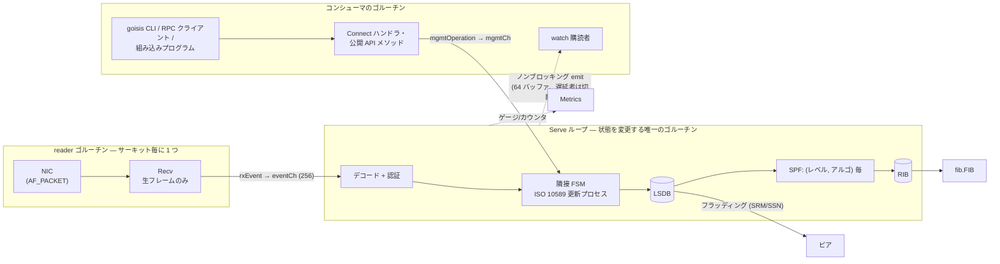

# 設計

goisis がどう組み立てられているか — 根底の思想、スレッドモデル、コードが
依存している不変条件、そして意図的な制約について。([English](design.md))

## 思想

goisis は [GoBGP](https://github.com/osrg/gobgp) の流儀を IS-IS に適用した
ものです:

- **ライブラリファースト。** 本体は `pkg/server.IsisServer` です。`goisisd`
  は YAML 設定と Connect RPC エンドポイントを足すだけの薄いラッパーで、
  `goisis` はその RPC を叩く CLI です。デーモンにできることは、組み込んだ
  プログラムから直接できます。
- **コアは依存フリー。** ライブラリコアは netlink も Prometheus も RPC
  スタックも import しません。副作用は `fib.FIB`（フォワーディング）と
  `server.Metrics`（テレメトリ）という 2 つの小さなインターフェースからのみ
  外へ出ます。デフォルトはどちらも no-op。netlink FIB と Prometheus
  アダプタは別パッケージで、リンクするのはデーモンだけです。
- **プロトコルは 1 つのゴルーチンが所有する。** 細粒度ロックの代わりに、
  プロトコル状態（サーキット、隣接、LSDB、RIB）はすべて単一のイベント
  ループが所有します。並行性バグはロックで防ぐのではなく、設計で排除
  します。[スレッドモデル](#スレッドモデル)を参照。
- **コーデックは純粋。** `pkg/packet` はバイト列と構造体を相互変換する
  関数群です — I/O なし、状態なし、継続的に fuzz され、FRR から採取した
  ゴールデン PDU とバイト単位で照合されます。
- **プロトコルコードは明示的に。** 状態機械は ISO/RFC の条項ごとに
  書き下ろし、自明でない判断には実装した条項を引くコメントを付けます。
  仕様と利便性が衝突したときは、どちらを取ったか・なぜかをファイルに
  書きます。
- **スコープの規律。** 広く緩い実装より、意図的に小さい MVP（単一エリア、
  ワイドメトリック）を丁寧に実装する方が良い。先送りした機能は
  [制約](#制約)に列挙し、その機能を将来難しくしうる設計判断には
  コメントでその旨を書いています。

## 全体像



| パッケージ | 役割 |
|-----------|------|
| `pkg/packet` | PDU/TLV コーデック。純粋、fuzz 済み、バイト正確なラウンドトリップ。 |
| `pkg/datalink` | サーキットのトランスポート: Linux では AF_PACKET、テスト用にレース安全なモック。 |
| `pkg/server` | インスタンス本体: 管理ループ、隣接 FSM、LSDB/フラッディング、SPF、RIB、生成、Connect ハンドラ、Flex-Algo。 |
| `pkg/fib` | `FIB` インターフェース + netlink 実装（`proto isis` の経路と seg6local End SID）。 |
| `pkg/config` | YAML → サーバーオプション。 |
| `pkg/metrics` | `server.Metrics` の Prometheus アダプタ（`client_golang` をリンクする唯一のパッケージ）。 |

## スレッドモデル

ゴルーチンはちょうど 3 種類で、プロトコル状態を変更できるのはそのうち
1 つだけです。

| ゴルーチン | 数 | 状態を触れるか | 仕事 |
|-----------|----|--------------|------|
| **Serve ループ** | 1 | **可 — 唯一** | 受信 PDU のデコードと認証、イベント・タイマー・管理操作の処理、SPF 実行、FIB 書き込み、watch イベントとメトリクスの発行。 |
| サーキット reader | サーキット毎に 1 | 不可 | 生フレームを `Recv` して `rxEvent` としてループへ転送。それだけ — デコードも状態も持たない。 |
| コンシューマ | 任意 | 不可 | 公開 API の呼び出し元と watch 購読者。内部状態は見えず、スナップショットとイベントだけを受け取る。 |

デコードはループ上で行われます（`handleRx`）: パディングを宣言 PDU 長に
切り詰め、PDU をデコードし、認証を検証してから初めてプロトコル状態に
触れます。デコード不能な PDU は debug ログの上で破棄されます。有用な帰結
として、コーデックですら敵対的入力を単一ゴルーチン上で直列にしかパース
しません。

### Serve ループ

`IsisServer.Serve` は 4 つのソースに対する単一の `select` です
（`pkg/server/server.go`）:

```go
select {
case <-ctx.Done():        // シャットダウン
case op := <-s.mgmtCh:    // 管理操作（公開 API 呼び出し）
case ev := <-s.eventCh:   // プロトコルイベント（受信フレーム等）
case t := <-ticker.C:     // 1 秒のハウスキーピング tick
}
if s.spfDirty { s.updateRIB(...) }   // イベント駆動 SPF
```

プロトコル状態を変更するものはすべて、このゴルーチン上で上記いずれかの
アームの中で実行されます。これがコードベースの中心的な不変条件です:
**Serve ゴルーチン上にいないなら、`IsisServer` のフィールドには触らない。**

- **管理操作。** `ListRoutes` のような読み取りも `AddLocator` のような
  変更も、すべての公開メソッドは本体を `mgmtOperation` に包みます。
  クロージャを `mgmtCh` でループへ送り、結果を待つ仕組みです。呼び出し元
  が受け取るのはクロージャのエラー、自身の context のエラー、または
  `ErrServerStopped` のいずれかで、シャットダウンと競合した結果も失われ
  ません（`server.go` の `done`/`errCh` の二重 select）。
- **イベント駆動 SPF。** 状態変更は SPF を直接呼ばず、`markDirty()` で
  `spfDirty` を立てるだけです。ループの*毎回*の反復後にフラグを確認する
  ので、固定の SPF タイマーなしに変更へ即応でき、イベントのバーストは
  1 ターンにつき 1 回の再計算にまとまります。
- **ハウスキーピング（1 秒 tick）。** hello 送信、隣接の期限切れ、LSP の
  エージング/リフレッシュ、SRM/SSN 再送、自分が DIS のサーキットでの
  周期 CSNP、ローカル SID の再アサート、ゲージ発行。

### バックプレッシャーなしのファンアウト

ループはコンシューマ側で決してブロックしてはなりません:

- **watcher**（`WatchEvent` 購読者）には 64 エントリのバッファ付き
  チャネルが割り当てられます。`emit` はノンブロッキング送信で、遅れた
  購読者はループを止める代わりに切断されます（チャネル close、
  `Lagged()` が true）。Connect ストリームはこれを `ResourceExhausted`
  に変換し、クライアントに再購読を促します。
- **メトリクス**の発行はループからのみ行われます。実装は読み取り/
  スクレイプ側の同期だけを気にすれば十分です。

### シンクの契約

注入される 2 つのインターフェースは*ループから同期的に*呼ばれるため、
厳格な契約を負います: **`datalink.Transport.Send` と `fib.FIB` の全メソッド
はブロックしてはなりません。** netlink 呼び出しのハングやソケットの詰まり
は、*すべての*サーキットの hello・隣接期限切れ・フラッディングを止めます —
ループはコントロールプレーンそのものだからです。遅い I/O を行う実装は内部
でキューイングして即座に返る必要があります。（`Recv` はブロックして
構いません。専用の reader ゴルーチンで動くためです。）

これは単一ループ設計の既知の構造的トレードオフです: 送信と FIB 書き込みは
現在プロトコルのゴルーチンを共有しています。実際に問題になった場合の進化
形として、サーキット毎の送信キューと非同期 FIB ワーカー（完了をイベント
としてループへ報告）への移行を想定しています。

### シャットダウンの順序

`Serve` の context をキャンセルすると固定の手順が走ります（`server.go` の
`shutdown`）:

1. **まず**自分の LSP をパージし、そのパージをワイヤへ送り切る —
   ネットワークが MaxAge までトラフィックを黒穴化する代わりに、即座に
   迂回できるように。
2. 全サーキットのトランスポートを閉じる（reader の `Recv` も解除される）。
3. ローカル End SID を FIB から削除する。
4. すべての watch 購読を閉じる。
5. reader ゴルーチンの終了を待つ。
6. キュー済みの管理操作を `ErrServerStopped` で排出する。

デーモンはその上に独自の順序を重ねます: RPC サーバーのドレインがループ
停止より先なので、処理中の RPC は生きたループに届きます。

## コーデックの設計

`pkg/packet` には 3 つのルールがあります:

1. **コンテキストで引く三層レジストリ。** TLV → sub-TLV → sub-sub-TLV の
   デコーダは親コンテキスト（`SubTLVContext*`）ごとに登録されます。同じ
   コードポイントでも親が違えば意味が違うからです。二重登録は init 時に
   panic します — ネットワーク入力では決して panic しません。
2. **未知は保持。** コーデックがモデル化していないコードポイントは
   `UnknownTLV`/`UnknownSubTLV` として生バイトごとデコードされ、同一
   バイト列に再シリアライズされます。goisis ノードは見たことのない拡張
   だらけのネットワークに置いても、それらを壊しません。
3. **デコード結果は*このノード*のため、生バイトはネットワークのため。**
   受信 LSP は受信したバイト列のまま保存・再フラッディングされます
   （`lspEntry.raw`）。送信時にパッチされるのは remaining-lifetime
   フィールドだけで、Fletcher チェックサムは意図的にそこを除外して
   います。チェックサム検証も再シリアライズではなく生バイトに対して
   行います。したがってフラッディングの正しさはコーデックのラウンド
   トリップ忠実性に依存しません。

コーデックの外で効く不変条件が 2 つあります:

- **プレフィックスのマスク。** ルーティングに入るすべてのデコーダは
  ホストビットをマスクするので、RIB・FIB・起動時スイープが同一の
  `netip.Prefix` をキーに使えます。マスクし忘れたプレフィックスは、
  スイープが二度と照合できない経路をインストールしてしまいます。
- **fuzz の契約。** `FuzzDecodePDU` / `FuzzDecodeTLVs` は
  decode → encode → decode が固定点に達すること（バイト一致ではなく
  冪等性 — 予約ビットは一度だけ正規化される）を、FRR 採取の PDU を
  シードに検証します。`FuzzVerifyAuth` と `FuzzParseNET` は任意入力で
  panic しないことを検証します。

## ルーティングパイプライン

- **LSDB。** レベルごとに 1 つ。エントリはデコード済み LSP と生バイトの
  両方を保持します（上記参照）。`newer()` が ISO 10589 の順序付けを実装
  し、パージはゼロ到達後 ZeroAgeLifetime の間保持されます。
- **フラッディング。** サーキット毎の SRM/SSN フラグ集合が再送を駆動
  します: LAN の信頼性は DIS の周期 CSNP から、p2p の信頼性は最小再送
  間隔付きの PSNP 応答から得ます。パージは自ノードの LSP も期限切れの
  外部 LSP も、ヘッダのみ（POI + 鍵設定時は認証）でフラッディングします。
- **生成。** 自 LSP は設定 + 隣接状態から再構築し、保存済みコピーと比較
  します — 内容が同じなら再フラッディングしません。1492 バイトの LSP
  バッファを超える TLV 集合はシリアライズサイズでフラグメント 0 +
  スピル分のフラグメント 1..255 に詰め、集合が縮んだら余ったフラグメント
  をパージします。
- **SPF。** LSDB から構築したトポロジ上で `(レベル, アルゴリズム)` ごと
  に Dijkstra を実行します。ISO の双方向接続チェック、擬似ノードの
  ゼロコスト辺、オーバーロードビットによる中継回避、64 ビット累積 +
  上限によるメトリックオーバーフロー対策、first-hop 集合の和による
  ECMP（プレフィックスレベルの anycast マージ含む）。`popMin` は線形
  走査です — O(V²) は文書化された MVP の選択です。
- **RIB → FIB。** レベル・アルゴリズム横断の経路選択は明示的な比較器
  （`betterRoute`）です: Level-1 が Level-2 に勝ち、次にアルゴリズム 0
  が Flex-Algo に勝ちます。RIB は*望ましい*状態を保持し、FIB 書き込み
  失敗は pending 集合に入って次の再計算でリトライされ、
  `goisis_fib_pending` ゲージで観測できます。起動時には前回の残骸経路
  を FIB からスイープします。
- **Flex-Algo（RFC 9350）。** 定義の勝者選出は priority / system-ID
  順。参加はアルゴリズムごとにトポロジを剪定します。現在計算するのは
  IGP メトリックのみで、制約 sub-sub-TLV は将来の ASLA 対応計算のため
  ワイヤ上で保持されます。

## セキュリティの姿勢

- **状態より先に認証。** HMAC 検証（RFC 5304 の MD5、RFC 5310 の
  SHA-1/256/384/512）はプロトコル処理の前に走ります。比較は定数時間
  （`hmac.Equal`）、digest・remaining-lifetime・チェックサムは仕様通り
  ゼロ化してから MAC を計算し、Authentication TLV を複数持つ PDU は検証
  失敗として破棄されます。
- **コーデックは敵対的入力を前提。** すべての長さフィールドはスライス
  やアロケーションの前に検証され、不正な PDU は破棄・カウントされる
  だけで、致命的にはなりません。
- **LSDB 上限。** `lsdb-entry-limit` はレベルごとの保存 LSP 数を制限し、
  無認証セグメントでの偽装ソースフラッディングに対する多層防御となり
  ます — 一次的な緩和策は認証です。
- **管理プレーン。** Connect API は認証なしの平文 h2c で、デフォルトは
  loopback バインドです。それ以外へのバインドには明示的な
  `-api-allow-remote` オプトインが必要です。公開する前に外部で保護して
  ください（TLS プロキシ、unix ソケットのパーミッション、ネットワーク
  ポリシー）。

## 制約

現マイルストーンの意図的なスコープです。設計上、どれも後から到達可能に
してあります。

| 制約 | 備考 |
|------|------|
| 単一エリア | L1/L2 の隣接とレベル別 SPF は動きますが、エリア間の経路リークはありません — up/down ビット（RFC 5305 §4.1 / RFC 5308 §2）はパース・保持されますが、生成時に立てることはありません。 |
| ワイドメトリックのみ | ナローメトリック TLV はパースしますが生成しません（`metric-style wide` のピアのみ）。 |
| マルチトポロジ（RFC 5120）なし | SPF/RIB のキーは `(レベル, アルゴリズム)` です。MT-ID は現れる箇所ではパースされますが、パイプラインには通していません。MT 対応はこのキーの拡張であり、既知かつ局所的な変更です。 |
| グレースフルリスタート（RFC 5306）なし | クラッシュ再起動してシーケンス 1 から再生成するピアは、こちらの保存済み高シーケンスコピーに負け、エージアウトまで（最大 MaxAge、1200 秒）無視されます。クリーンな停止はパージするので、影響するのは非正常な再起動のみです。 |
| BFD なし | 障害検出は hello ベース（hold time）です。 |
| シーケンス番号ラップ非対応 | 2³² 到達時の ISO 10589 の枯渇手順は文書化のみで未実装です。900 秒リフレッシュなら約 12 万年先です。 |
| Flex-Algo は IGP メトリックのみ | FAD 制約（admin group、SRLG、遅延）はワイヤ上で保持しますが評価しません。 |
| ループ上の同期送信/FIB | [シンクの契約](#シンクの契約)参照: ノンブロッキングは実装への契約であり、構造による強制ではありません。 |
| 変更ごとの全再計算 | インクリメンタル SPF はなく、トポロジ変更のたびに `(レベル, アルゴリズム)` のトポロジを再構築します。MVP 規模のエリアには十分です。 |
| RFC 7987 の lifetime 下限なし | 受信 LSP のエージングは広告された remaining lifetime にそのまま従います。 |
| End.DT46 | `fib` API では宣言されていますが netlink FIB ではプログラムできません（vendored ライブラリに該当 seg6local アクションがないため）。End/End.DT4/End.DT6 は動きます。 |

## テスト戦略

| 層 | 方法 |
|----|------|
| コーデック | ユニットテスト + FRR から採取したゴールデン PDU（`test/fixturegen`）+ 継続的 fuzz（冪等性 + no-panic の契約）。 |
| プロトコル | インプロセステスト: `datalink.Link` のモックトランスポートで結線したサーバー同士が実際に収束します（隣接、フラッディング、経路）。特権不要。ホワイトボックステストは LSP を注入（`injectLSP`）し `computeSPF` を直接呼びます。 |
| 決定性 | テストは可能な限り sleep ではなく `mgmtOperation` の往復で同期します — それを可能にしているのが単一ループ設計です。 |
| 相互接続 | `test/interop`: veth ペアのホスト側に goisis、対向に本物の FRR isisd コンテナ（broadcast + p2p、認証、SRv6、Flex-Algo、フラグメンテーション、プログラム済み経路経由の ping）。root + docker が必要で、CI では push/PR ごとに実行されます。 |
