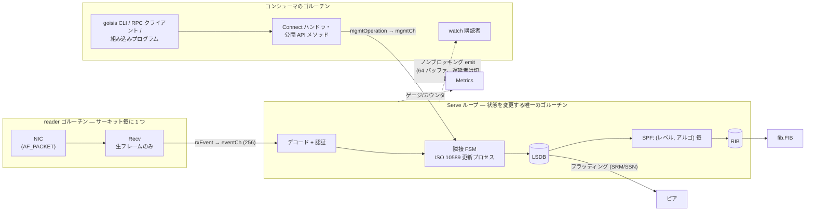

# 設計

goisis がどう組み立てられているか — 根底の思想、スレッドモデル、コードが
依存している不変条件、そして意図的な制約について。([English](design.md))

## 思想

goisis は [GoBGP](https://github.com/osrg/gobgp) の流儀を IS-IS に適用した
ものです:

- **ライブラリファースト。** 本体は `pkg/server.IsisServer` です。`goisisd`
  は YAML 設定と Connect RPC エンドポイントを足すだけの薄いラッパーで、
  `goisis` はその RPC を叩く CLI です。デーモンにできることは、組み込んだ
  プログラムから直接できます。
- **コアは依存フリー。** ライブラリコアは netlink も Prometheus も RPC
  スタックも import しません。副作用は `fib.FIB`（フォワーディング）と
  `server.Metrics`（テレメトリ）という 2 つの小さなインターフェースからのみ
  外へ出ます。デフォルトはどちらも no-op。netlink FIB と Prometheus
  アダプタは別パッケージで、リンクするのはデーモンだけです。
- **プロトコルは 1 つのゴルーチンが所有する。** 細粒度ロックの代わりに、
  プロトコル状態（サーキット、隣接、LSDB、RIB）はすべて単一のイベント
  ループが所有します。並行性バグはロックで防ぐのではなく、設計で排除
  します。[スレッドモデル](#スレッドモデル)を参照。
- **コーデックは純粋。** `pkg/packet` はバイト列と構造体を相互変換する
  関数群です — I/O なし、状態なし、継続的に fuzz され、FRR から採取した
  ゴールデン PDU とバイト単位で照合されます。
- **プロトコルコードは明示的に。** 状態機械は ISO/RFC の条項ごとに
  書き下ろし、自明でない判断には実装した条項を引くコメントを付けます。
  仕様と利便性が衝突したときは、どちらを取ったか・なぜかをファイルに
  書きます。
- **スコープの規律。** 広く緩い実装より、意図的に小さい MVP（単一エリア、
  ワイドメトリック）を丁寧に実装する方が良い。先送りした機能は
  [制約](#制約)に列挙し、その機能を将来難しくしうる設計判断には
  コメントでその旨を書いています。

## 全体像


```mermaid
flowchart LR
    subgraph readers["reader ゴルーチン — サーキット毎に 1 つ"]
        NIC["NIC<br/>(AF_PACKET)"] --> RECV["Recv<br/>生フレームのみ"]
    end
    subgraph serve["Serve ループ — 状態を変更する唯一のゴルーチン"]
        DECODE["デコード + 認証"] --> PROTO["隣接 FSM<br/>ISO 10589 更新プロセス"]
        PROTO --> LSDB[("LSDB")]
        LSDB --> SPF["SPF: (レベル, アルゴ) 毎"] --> RIB[("RIB")]
    end
    subgraph consumers["コンシューマのゴルーチン"]
        API["goisis CLI / RPC クライアント /<br/>組み込みプログラム"] --> HANDLERS["Connect ハンドラ・<br/>公開 API メソッド"]
        WATCH["watch 購読者"]
    end
    RECV -- "rxEvent → eventCh (256)" --> DECODE
    HANDLERS -- "mgmtOperation → mgmtCh" --> PROTO
    LSDB -- "フラッディング (SRM/SSN)" --> PEERS["ピア"]
    RIB --> FIB["fib.FIB"]
    serve -. "ノンブロッキング emit<br/>(64 バッファ、遅延者は切断)" .-> WATCH
    serve -. "ゲージ/カウンタ" .-> MET["Metrics"]
```

| パッケージ | 役割 |
|-----------|------|
| `pkg/packet` | PDU/TLV コーデック。純粋、fuzz 済み、バイト正確なラウンドトリップ。 |
| `pkg/datalink` | サーキットのトランスポート: Linux では AF_PACKET、テスト用にレース安全なモック。 |
| `pkg/server` | インスタンス本体: 管理ループ、隣接 FSM、LSDB/フラッディング、SPF、RIB、生成、Connect ハンドラ、Flex-Algo。 |
| `pkg/fib` | `FIB` インターフェース + netlink 実装（`proto isis` の経路と seg6local End SID）。 |
| `pkg/config` | YAML → サーバーオプション。アドレス/リンク変更を流し込む netlink watcher も。 |
| `pkg/metrics` | `server.Metrics` の Prometheus アダプタ（`client_golang` をリンクする唯一のパッケージ）。 |

## スレッドモデル

ゴルーチンはちょうど 3 種類で、プロトコル状態を変更できるのはそのうち
1 つだけです。

| ゴルーチン | 数 | 状態を触れるか | 仕事 |
|-----------|----|--------------|------|
| **Serve ループ** | 1 | **可 — 唯一** | 受信 PDU のデコードと認証、イベント・タイマー・管理操作の処理、SPF 実行、FIB 書き込み、watch イベントとメトリクスの発行。 |
| サーキット reader | サーキット毎に 1 | 不可 | 生フレームを `Recv` して `rxEvent` としてループへ転送。一時的な `Recv` エラーはログに出して 1 秒後に再試行。それだけ — デコードも状態も持たない。 |
| コンシューマ | 任意 | 不可 | 公開 API の呼び出し元と watch 購読者。内部状態は見えず、スナップショットとイベントだけを受け取る。 |

デコードはループ上で行われます（`handleRx`）: パディングを宣言 PDU 長に
切り詰め、PDU をデコードし、認証を検証してから初めてプロトコル状態に
触れます。デコード不能な PDU は debug ログの上で破棄されます。有用な帰結
として、コーデックですら敵対的入力を単一ゴルーチン上で直列にしかパース
しません。

### Serve ループ

`IsisServer.Serve` は 5 つのソースに対する単一の `select` です
（`pkg/server/server.go`）:

```go
select {
case <-ctx.Done():        // シャットダウン
case op := <-s.mgmtCh:    // 管理操作（公開 API 呼び出し）
case ev := <-s.eventCh:   // プロトコルイベント（受信フレーム等）
case t := <-ticker.C:     // 1 秒のハウスキーピング tick
case <-hold.C:            // SPF back-off の hold 満了
}
s.drainLSPGen(time.Now())                        // まとめた自 LSP の再生成
if s.spfDirty && !holding { s.updateRIB(...) }   // イベント駆動 SPF（RFC 8405 風の hold 付き）
```

プロトコル状態を変更するものはすべて、このゴルーチン上で上記いずれかの
アームの中で実行されます。これがコードベースの中心的な不変条件です:
**Serve ゴルーチン上にいないなら、`IsisServer` のフィールドには触らない。**

- **管理操作。** `ListRoutes` のような読み取りも `AddLocator` のような
  変更も、すべての公開メソッドは本体を `mgmtOperation` に包みます。
  クロージャを `mgmtCh` でループへ送り、結果を待つ仕組みです。呼び出し元
  が受け取るのはクロージャのエラー、自身の context のエラー、または
  `ErrServerStopped` のいずれかで、シャットダウンと競合した結果も失われ
  ません（`server.go` の `done`/`errCh` の二重 select）。
- **イベント駆動 SPF。** 状態変更は SPF を直接呼ばず、`markDirty()` で
  `spfDirty` を立てるだけです。最初の変更はそのループ反復の末尾で即座に
  再計算し、続く 200 ms の hold 中に届いた変更は hold 満了時の 1 回の
  再計算にまとまります（RFC 8405 の 2 状態版、LONG_WAIT 段階なし）。
- **ハウスキーピング（1 秒 tick）。** hello 送信、隣接の期限切れ、LSP の
  エージング/リフレッシュ、SRM/SSN 再送、
  自分が DIS のサーキットでの周期 CSNP、ローカル SID の再アサート、ゲージ
  発行。
- **インタフェースイベント。** アドレスと直結サブネットは起動時に一度読む
  だけではありません。デーモンは netlink のアドレス/リンク変更を購読し
  （`pkg/config.WatchInterfaces`）、管理操作として流し込みます — 付け替えは
  `SetCircuitAddresses`、キャリアは `SetCircuitLinkState` です。リンクダウン
  が報告されたサーキットは、隣接のホールドタイム満了を待たずに即座に隣接を
  落とします。netlink の配送は保証されないため、購読エラー時と 30 秒ごとに
  監視対象インタフェースを読み直します。どちらのセッタも冪等なので、メッセージ
  の取りこぼしは再起動ではなく 1 周期で回復します。コアは netlink に依存しないままです: watcher はデーモン側の
  パッケージにあり、組み込み利用者はイベント源を自分で持ちます。

### バックプレッシャーなしのファンアウト

ループはコンシューマ側で決してブロックしてはなりません:

- **watcher**（`WatchEvent` 購読者）には 64 エントリのバッファ付き
  チャネルが割り当てられます。`emit` はノンブロッキング送信で、遅れた
  購読者はループを止める代わりに切断されます（チャネル close、
  `Lagged()` が true）。Connect ストリームはこれを `ResourceExhausted`
  に変換し、クライアントに再購読を促します。
- **メトリクス**の発行はループからのみ行われます。実装は読み取り/
  スクレイプ側の同期だけを気にすれば十分です。`SIGHUP` によるリロードは
  デーモン側のゴルーチンで走るため、結果の報告は
  `IsisServer.ReportConfigReload` を通してループへ載せ、信号を受けた
  ゴルーチンからシンクを直接叩くことはしません。

### シンクの契約

注入される 2 つのインターフェースは*ループから同期的に*呼ばれるため、
厳格な契約を負います: **`datalink.Transport.Send` と `fib.FIB` の全メソッド
はブロックしてはなりません。** netlink 呼び出しのハングやソケットの詰まり
は、*すべての*サーキットの hello・隣接期限切れ・フラッディングを止めます —
ループはコントロールプレーンそのものだからです。遅い I/O を行う実装は内部
でキューイングして即座に返る必要があります。（`Recv` はブロックして
構いません。専用の reader ゴルーチンで動くためです。）

これは単一ループ設計の既知の構造的トレードオフです: 送信と FIB 書き込みは
現在プロトコルのゴルーチンを共有しています。実際に問題になった場合の進化
形として、サーキット毎の送信キューと非同期 FIB ワーカー（完了をイベント
としてループへ報告）への移行を想定しています。

### シャットダウンの順序

`Serve` の context をキャンセルすると固定の手順が走ります（`server.go` の
`shutdown`）:

1. **まず**自分の LSP をパージし、そのパージをワイヤへ送り切る —
   ネットワークが MaxAge までトラフィックを黒穴化する代わりに、即座に
   迂回できるように。
2. 全サーキットのトランスポートを閉じる（reader の `Recv` も解除される）。
3. ローカル End SID を FIB から削除する。
4. すべての watch 購読を閉じる。
5. reader ゴルーチンの終了を待つ。
6. キュー済みの管理操作を `ErrServerStopped` で排出する。

デーモンはその上に独自の順序を重ねます: RPC サーバーのドレインがループ
停止より先なので、処理中の RPC は生きたループに届きます。

## コーデックの設計

`pkg/packet` には 3 つのルールがあります:

1. **コンテキストで引く三層レジストリ。** TLV → sub-TLV → sub-sub-TLV の
   デコーダは親コンテキスト（`SubTLVContext*`）ごとに登録されます。同じ
   コードポイントでも親が違えば意味が違うからです。二重登録は init 時に
   panic します — ネットワーク入力では決して panic しません。
2. **未知は保持。** コーデックがモデル化していないコードポイントは
   `UnknownTLV`/`UnknownSubTLV` として生バイトごとデコードされ、同一
   バイト列に再シリアライズされます。goisis ノードは見たことのない拡張
   だらけのネットワークに置いても、それらを壊しません。
3. **デコード結果は*このノード*のため、生バイトはネットワークのため。**
   受信 LSP は受信したバイト列のまま保存・再フラッディングされます
   （`lspEntry.raw`）。送信時にパッチされるのは remaining-lifetime
   フィールドだけで、Fletcher チェックサムは意図的にそこを除外して
   います。チェックサム検証も再シリアライズではなく生バイトに対して
   行います。したがってフラッディングの正しさはコーデックのラウンド
   トリップ忠実性に依存しません。

コーデックの外で効く不変条件が 2 つあります:

- **プレフィックスのマスク。** ルーティングに入るすべてのデコーダは
  ホストビットをマスクするので、RIB・FIB・起動時スイープが同一の
  `netip.Prefix` をキーに使えます。マスクし忘れたプレフィックスは、
  スイープが二度と照合できない経路をインストールしてしまいます。
- **fuzz の契約。** `FuzzDecodePDU` / `FuzzDecodeTLVs` は
  decode → encode → decode が固定点に達すること（バイト一致ではなく
  冪等性 — 予約ビットは一度だけ正規化される）を、FRR 採取の PDU を
  シードに検証します。`FuzzVerifyAuth` と `FuzzParseNET` は任意入力で
  panic しないことを検証します。

## ルーティングパイプライン

- **LSDB。** レベルごとに 1 つ。エントリはデコード済み LSP と生バイトの
  両方を保持します（上記参照）。`newer()` が ISO 10589 の順序付けを実装
  します。受信した remaining lifetime が MaxAge 未満なら MaxAge として保存
  するので、チェックサムの対象外であるこのフィールドが化けても、生成元の
  リフレッシュより先に LSP がエージアウトすることはありません（RFC 7987
  §2）。ZeroAgeLifetime 未満の値が、それ以上 Up である隣接から届いたときは
  §3.2 の CorruptRemainingLifetime イベントを上げます。パージはゼロ到達後
  ZeroAgeLifetime の間保持されます。
- **フラッディング。** サーキット毎の SRM/SSN フラグ集合が再送を駆動
  します: LAN の信頼性は DIS の周期 CSNP から得ます。CSNP は LSP ID の範囲
  ごとに複数 PDU へ分割するので、1 PDU に収まらない規模の DB でも MTU を
  超えません。また、ブロードキャストサーキットで PSNP 要求を処理するのは
  Designated IS だけです（ISO 10589 7.3.15.2 b）。p2p の信頼性は最小再送
  間隔付きの PSNP 応答から得ます。更新プロセスが LSP・CSNP・PSNP を受け付け
  るのは、送信元 SNPA と Up の隣接がある場合だけです
  （ISO 10589 7.3.15.1/7.3.15.2）。p2p サーキットは Up の隣接がなければ何も
  送らず、隣接が落ちたらフラグを捨てます。隣接が Up になったときは、その
  レベルの DB 全体にフラグを立て直して CSNP を送ります（`syncCircuitLevel`、
  ISO 10589 7.3.17）— p2p には後から穴を埋める周期 CSNP がないためです。
  どちらもペーシングします。1 回の housekeeping で送る LSP はサーキット・
  レベルあたり最大 `maxLSPSendPerTick` 個で、残りはフラグを保ったまま次以降
  の tick に回します。また、前回から `syncHoldDown` 以内に要求された同期は
  実行せずその終了まで遅らせるので、ハンドシェイクをフラップさせる隣接が
  毎秒 DB 全体の走査を強いることはありません。
  サーキットに収まらない大きさの LSP は、永遠に再送する代わりにそのサーキット
  で一度警告して捨てます。パージは自ノードの LSP も期限切れの外部 LSP も、
  ヘッダのみ（POI + 鍵設定時は認証）でフラッディングします。DB が持っていない
  LSP ID へのパージは ACK は返しますが保存しません（7.3.16.4 a）。自分の
  System ID を名乗るが自分のものではない LSP は、再フラッディングせずパージ
  します（7.3.16.4 c）。
- **生成。** 自 LSP は設定 + 隣接状態から再構築し、保存済みコピーと比較
  します — 内容が同じなら再フラッディングしません。イベント起点の再生成は
  1 秒に 1 回までにまとめ（minimumLSPGenerationInterval）、900 秒のリフレッシュ
  は最大 25 % 早める形でジッタを入れます（同時に起動したノードが足並みを
  揃えてリフレッシュしないように）。再生成は管理ループのある周回で*要求*され、
  次の周回の先頭で*ドレイン*されます。したがって再計算でしか分からない変化 —
  その周回の SPF 判定が終わった後に `updateRIB` が決める Level-1 から
  Level-2 への export 集合 — がワイヤに出るまでの遅延は、最悪で
  minimumLSPGenerationInterval + housekeeping 1 ティック（約 2 秒）です。
  保証しているのはこの上限であって、個々の周回の順序ではありません:
  無風のネットワークでは housekeeping ティックで、負荷のあるネットワークでは
  次のイベントでドレインされます。LSP バッファ(1492
  バイト、サーキットや `lsp-mtu` がより狭ければその値)を超える TLV 集合は
  シリアライズサイズでフラグメント 0 + スピル分のフラグメント 1..255 に
  詰め、集合が縮んだら余ったフラグメントをパージします。End.X SID の整合も
  この再生成で取ります: グローバルな on-link アドレスを持つ Up の隣接は、
  隣接が参加しているアルゴリズムの locator ごとに 1 つ SID を持ち、値はその
  locator の function 空間から取ります。隣接・アドレス・参加のいずれかが
  消えた SID は解放し、FIB からも削除します。アドレスも参加も隣接の
  fragment 0 LSP に載ってきて、隣接成立より後に届くため、その格納が再生成を
  要求します。
- **SPF。** LSDB から構築したトポロジ上で `(レベル, アルゴリズム)` ごと
  に Dijkstra を実行します。ISO の双方向接続チェック、擬似ノードの
  ゼロコスト辺、オーバーロードビットによる中継回避、64 ビット累積 +
  上限によるメトリックオーバーフロー対策、first-hop 集合の和による
  ECMP（プレフィックスレベルの anycast マージ含む）。`popMin` は線形
  走査です — O(V²) は文書化された MVP の選択です。
- **RIB → FIB。** レベル・アルゴリズム横断の経路選択は明示的な比較器
  （`betterRoute`）です: Level-1 が Level-2 に勝ち、次にアルゴリズム 0
  が Flex-Algo に勝ちます。RIB は*望ましい*状態を保持し、FIB 書き込み
  失敗は pending 集合に入り、次の再計算で、無変化のネットワークでは
  housekeeping ティックごとにリトライされます。集合の大きさは
  `goisis_fib_pending` ゲージで観測できます。起動時には前回の残骸経路
  を FIB からスイープします。
- **ローカル SID。** End / End.DT SID は `isis-srv6` という dummy デバイス上の
  `seg6local` 経路として置きます。このデバイスは netlink FIB が必要になった
  時点で作り、最後の SID が消えたときに削除します（起動時の sweep でも同様に
  刈るため、locator を広報しなくなった実行では経路もデバイスも残りません）。
  ループバックには載せられません: Linux（6.12 で確認）は出力デバイスが `lo` の
  `seg6local` 経路の lwtunnel state を落とすため、encap の無い素の経路だけが
  残り、その SID に向いたパケットは黙って捨てられます。デバイスは経路をぶら
  下げる場所でしかないので locator ごとではなく 1 本を共有し、名前も固定に
  して、再起動時は前回作ったものをそのまま使います。End.X SID だけは例外で、
  隣接のある回線に載せます。デバイスを作れない場合はログを 1 回だけ出し
  （投入自体は housekeeping ごとに再試行します）、
  `goisis_fib_errors_total{op="add_sid"}` で数えます。デーモンは起動も経路
  計算も続けます。
- **Flex-Algo（RFC 9350）。** 定義の勝者選出は priority / system-ID
  順。参加はアルゴリズムごとにトポロジを剪定します。End.X SID は取り出し元
  locator のアルゴリズムを持つ（RFC 9352 §8.1）ため、Flex-Algo locator が
  どの隣接に End.X を配るかも、その参加情報で決まります。リンクは
  admin group で剪定します。§13 の手順 1・3・4（exclude、include-any、
  include-all）です。リンクの色は §12 の要求どおり ASLA の広報（RFC 8919
  §4.2）から読み、TLV 22 のレガシー sub-TLV は L フラグを立てた ASLA が
  そちらへ誘導する場合に限って読みます。自分の色は `admin-group` で
  サーキットごとに広報します。§13 が色を見るのは LAN pseudonode へ向かう
  メンバ側のエッジで、pseudonode から戻るエッジではありません。後者はリンク
  属性を一切持たないからです。片方向だけ色を付ければ足りるのは、双方向性
  チェックが逆向きエッジの存在を既に要求しているためです。評価*しない*もの
  — 除外 SRLG、IGP 以外の metric-type、goisis が実装していない定義フラグや
  sub-sub-TLV — は、制約を落として緩く計算するのではなく、そのアルゴリズム
  を計算不能として扱います。`updateRIB` はそのアルゴリズムの経路を一切投入
  せず、警告を 1 回出します。色は End.X の条件には入れていません。剪定された
  リンク上の SID は誤りではなく使われないだけで、剪定するルールはサーキットの
  ものではなくエリアのものだからです。

## セキュリティの姿勢

- **状態より先に認証。** HMAC 検証（RFC 5304 の MD5、RFC 5310 の
  SHA-1/256/384/512）はプロトコル処理の前に走ります。比較は定数時間
  （`hmac.Equal`）、digest・remaining-lifetime・チェックサムは仕様通り
  ゼロ化してから MAC を計算し、Authentication TLV を複数持つ PDU は検証
  失敗として破棄されます。
- **コーデックは敵対的入力を前提。** すべての長さフィールドはスライス
  やアロケーションの前に検証され、不正な PDU は破棄・カウントされる
  だけで、致命的にはなりません。
- **LSDB 上限。** `lsdb-entry-limit` はレベルごとの保存 LSP 数を制限し、
  無認証セグメントでの偽装ソースフラッディングに対する多層防御となり
  ます — 一次的な緩和策は認証です。
- **管理プレーン。** Connect API は認証なしの平文 h2c で、デフォルトは
  loopback バインドです。それ以外へのバインドには明示的な
  `-api-allow-remote` オプトインが必要です。`:50051` のようにホスト部を空に
  した指定も全インターフェイスへのバインドとして扱います。ローカルアクセス
  には `-api-listen unix:///run/goisis/goisisd.sock` を推奨します。ソケットは
  umask を掛けて bind するので生成された瞬間からモード `0660` で、ファイル
  システムのパーミッションがアクセス制御になります。TCP loopback には認可の
  根拠になる識別子がなく、ローカルの任意の UID がエリア全体の到達性を広報
  できてしまいますが、unix ソケットを既定にするのはデーモンと CLI の破壊的
  変更なので 0.4.0 に見送ります。ネットワーク越しに公開する場合は外部での
  保護（TLS プロキシ、ネットワークポリシー）が必要です。

## 制約

現マイルストーンの意図的なスコープです。設計上、どれも後から到達可能に
してあります。

| 制約 | 備考 |
|------|------|
| 単一エリア | L1/L2 の隣接とレベル別 SPF は動き、L1 のみのノードは最も近い attached な L1L2 IS へのデフォルト経路を入れ（ATT ビット、RFC 1195 §3.2）、ただしこれは自身のメトリックを持たないフォールバックなので、広報されたデフォルト経路には必ず負けます（RFC 5302 §1.1）。L1L2 IS は Level-1 SPF で到達したプレフィックスを Level-2 LSP へ伝播し（ISO 10589 7.2.9 / RFC 1195 §3.1）、`policy.leak-l2-to-l1` で指定された Level-2 プレフィックスを up/down ビット付きで Level-1 LSP へリークします（RFC 5305 §4.1 / RFC 5308 §2）。指定がなければリークしません。down のプレフィックスを上へ戻すことはありません。エリア間ルーティングは依然として L1L2 ノードあたり 1 エリアを前提とします。 |
| ワイドメトリックのみ | ナローメトリック TLV はパースしますが生成しません（`metric-style wide` のピアのみ）。 |
| マルチトポロジ（RFC 5120）は読むだけ | TLV 222・229・235・237 をデコードし `database --detail` に表示します。MT #2 の IPv6 到達性（TLV 237、§7.4）は唯一の IPv6 RIB に畳み込みます。したがって `topology ipv6-unicast` を設定したピア（IPv6 プレフィックスを TLV 236 から外すピア）に対して IPv6 経路を 1 本も学習しない、という無音の失敗はなくなりました。実装していないのは §6 が要求する 2 つ目の決定プロセスです: SPF/RIB のキーは `(レベル, アルゴリズム)` のままで、MT #2 プレフィックスへの経路は MT #0 のグラフ（TLV 22。TLV 222 の MT #2 リンクは使いません）上で計算し、MT #3/#4/#5 と TLV 235 の IPv4 はデコードするだけで経路計算には使いません。よって MT #0 と合同でない MT #2 では IPv6 プレフィックスに MT #0 のメトリックとネクストホップが付き、MT #2 のリンクからしか届かないノードには到達できません。畳み込みは自ノードの RIB までで止めます: MT #2 でしか広報されていないプレフィックスは経路としては使いますが、他レベルの LSP へは再生成しません（`l1ExportSet` と `l2LeakSet` が飛ばします）。§4 がレベル間のルートリークは同一 MT 内に限るべきだとしており、goisis が書けるのは TLV 236 だけなので、どの広報も主張していない MT #0 の到達性を名乗ることになるからです。MT TLV の生成は意図的に行いません: TLV 229 が無いことは「MT #0 のみ」を意味し（§7.1）、それが goisis の実態そのものだからです。MT #2 を名乗れば MT #2 の IS 到達性の広報（§3）と 2 つ目の決定プロセスの実行が義務になります。これらをまとめて解くのはキーを `(レベル, トポロジ, アルゴリズム)` へ広げる変更で、`pkg/fib` にもテーブルの次元が要ります。 |
| グレースフルリスタート（RFC 5306）は helper 側のみ | §4.1 の "Running Router" 側を実装しています。この表は 4 行のイベント表であり、その 4 つすべてに答えている以上、部分実装ではなく準拠実装です。すでに Up の隣接から RR ビット付きの IIH を受け取ると、IS Neighbors や三方向ハンドシェイクの TLV が何を言っていようと隣接をそのまま Up に保ちます。再起動中のルータは隣接データベースを失っていて誰もエコーできないので、そこが要点です。受信したらただちに、その隣接に実際に残っている時間を載せて ACK を返し、§3.2.1c が選ぶルータ（restart TLV を出す Up 隣接のうち、自身が再起動中でないものを除いた中で最高優先度。DIS とは限りません）が完全な CSNP セットと全 LSP への SRM を送ります。hold time を更新するのは最初の要求だけなので、再起動を繰り返すピアが隣接を無限に固定することはできません。そして再試行のたびに縮む Remaining Time こそ、restarter が T3 を組み立てる材料です。SA ビット付きの IIH を受け取った隣接は、SA クリアの IIH が来るまで自ノードの LSP からも SPF からも外れます。この 2 つの状態はいずれも観測できるようにしてあります。ヘルパが正しく動いているとき、従来オペレータの手がかりだった「隣接ダウン」イベントは*起きない*からです: `goisis_restart_requests_total` が §3.2.1 の前提条件を満たしたかどうかで要求を数え、`goisis_adjacencies_suppressed` が `goisis_adjacencies` とトポロジの差を示し、`goisis neighbor` は `RESTART` 列で両方を名指しし、ログは hello ごとではなく状態の境目で出します。運用上の効果は、隣人の計画メンテナンス中に goisis がエリア全体の障害を引き起こさなくなることです。goisis が実際に置かれる混在ネットワークでは、この向きこそが効きます。restarter 側（T1/T2/T3、RR と SA の送出、停止時 purge の抑止、起動時に見つけたデータベースを捨てずに引き継ぐこと）は未実装です。再起動をまたいで残る状態が必要で、デーモンは意図的にそれを持ちません。したがって自ノードの再起動は依然として非正常な再起動です。隣接ルータは隣接を張り直し、エリアに残った自分の LSP のコピーは、シーケンス 1 から再生成したものに対して、そのコピーがエージアウトするまで勝ち続けます。RFC 7987 の下限により、その時間は生成元の残り寿命ではなく「相手のノードが格納した時点から MaxAge（1200 秒）」です。上限ではなく通常のケースであり、MaxAge を超える lifetime はそのまま保持するのでさらに延びることもあります。ただし際限なく延びるわけではありません。最初に格納したノードが最初にゼロへ達してパージをフラッディングし、後から格納したノードは同一シーケンスのパージとしてそれを受け入れます。クリーンな停止はパージするので、影響するのは非正常な再起動のみです。 なお FRR 10.6.1 の isisd には graceful-restart コマンドが無く TLV 211 も送出しないため、helper 側を FRR 相手に動かすことはできません。interop で固定できるのは「シグナリング無しで再起動した対向は従来どおり隣接を失う」という反対側の主張だけです。 |
| BFD なし | 障害検出は hello ベース（hold time）です。 |
| System ID・エリア・認証鍵の実行時変更なし | プレフィックス、locator、Flex-Algo、オーバーロードビット、隣接のリセット、そしてサーキット自体も実行時に変更でき、サーキットのアドレスとキャリアは実時間で追従します（`SetCircuitAddresses` / `SetCircuitLinkState`）。`AddCircuit` は呼び出し側が開いたトランスポートを受け取って追加し（管理ループ上で開くと 3 つのシステムコールの後ろに他の全サーキットが待たされます）、`DeleteCircuit` は隣接を落とし、保持していた pseudonode LSP を purge し、寄与していたサブネットを取り下げ、トランスポートを閉じます。`SIGHUP` は設定ファイルからその両方を発行します: 定義が変わったサーキットは削除して作り直すため隣接が落ち、落ちる前に名指しで警告します。開けなかったインタフェースはリロードを partial のまま残し、次のシグナルが再試行します。再起動が必要なまま残るのは System ID・エリア・認証鍵で、accept リスト（`*-accept-passwords`）により鍵の変更は一斉切り替えではなくローリング再起動で済みます。 |
| シーケンス番号の枯渇は当該 LSP ID の停止を伴う | 通常のリフレッシュが 2³²−1 に達することはありません（900 秒間隔なら約 12 万年）が、偽造 LSP 1 通なら一瞬で到達するため、ISO 10589 7.3.16.1 の枯渇手順を実装しています（`exhaustSeq`）: 2³²−1 でパージをフラッディングし（同一シーケンスではパージが生存コピーに優先するので 7.3.16.2、より大きな番号は不要）、全ノードがそのパージを破棄するまで ZeroAgeLifetime + 余裕だけ当該 ID を停止させ、その後 1 から再生成します。この停止期間は当該 LSP ID がエリア全体で失われる時間です。偽造をそもそもワイヤに乗せないのは認証の役割です。 |
| Flex-Algo の剪定は admin group のみ | 制約が admin group だけの定義は厳密に計算します（RFC 9350 §13 の手順 1・3・4）。除外 SRLG、IGP 以外の metric-type、goisis が実装していない sub-sub-TLV や定義フラグを併せて要求する定義は、制約を落として計算するのではなく丸ごと拒否します（そのアルゴリズムの経路は投入しません）。制約自体はいずれもワイヤ上で保持し、`ListFlexAlgos` と `goisis flex-algo` で報告します。定義の制約を goisis 自身が*広報*することはしません。エリアの FAD 広報者は通常 1 台で、それが goisis である必要はないためです。 |
| ループ上の同期送信/FIB | [シンクの契約](#シンクの契約)参照: ノンブロッキングは実装への契約であり、構造による強制ではありません。 |
| RFC 8405 の LONG_WAIT なし | SPF back-off は 2 状態です（最初は即時再計算、その後 200 ms まとめる）。継続的な変動時に長い待ちへ段階を上げる挙動は意図的に省いています。MVP 規模では 2 つ目のしきい値は収束をさらに遅らせるだけだからです。 |
| 変更ごとの全再計算 | インクリメンタル SPF はなく、トポロジ変更のたびに `(レベル, アルゴリズム)` のトポロジを再構築します。`BenchmarkComputeSPF`（リング + ノードごとにランダムな弦 1 本）での 1 回の再計算は 50 ノードで 117 µs、200 ノードで 470 µs、1000 ノードで 9.1 ms です。`updateRIB` は `(レベル, アルゴリズム)` ごとに 1 回呼ぶので、現実的な最悪ケース（2 レベル × アルゴリズム 0 + Flex-Algo 1 つ）は 4 回で、これが 200 ms のバックオフ窓と 1 秒の housekeeping tick に対する比率です。1000 ノードで支配的なのは最短経路探索ではなく `buildTopology` の map 操作なので、インクリメンタル SPF は最初に手を出す先ではありません。全再計算と完全に一致させ続ける必要のある依存状態を数百行抱えて、既に安いほうの半分を削ることになります。 |
| RFC 7987 の報告は件数であって記録ではない | 両方とも実装済みです（上の **LSDB** 参照）。下限は、受信 lifetime が MaxAge 未満なら MaxAge で保存し、MaxAge 超過の値は生成元がより大きな MaxAge で動作している可能性があるためそのまま保持し（§3.1）、下限値は設定可能にせず MaxAge 固定です。§3.2 の `CorruptRemainingLifetime` イベントは、受信したサーキット単位の `goisis_lsp_lifetime_corrupt_total` として上げます。§3.2 の 4 条件のうち 2 つは格納経路上のどこで報告するかで既に決まっており（7.3.15.1 の受入検査を通過済みで、手元のコピーより新しい）、残り 2 つを検査します: lifetime が ZeroAgeLifetime 未満であることと、受信した隣接のデータベース交換が始まってからそれ以上経っていることで、後者が再同期を除外する誤検出フィルタです。§3.2 は後者を「隣接自体が Up であった時間」と書いていますが（リスタートヘルパがなければ両者は同じ値です）、RFC 5306 §3.2.1c は再起動中の隣接に対して、意図的に Up のまま保たれた隣接の上でデータベース全体を渡します。§3.2 を字面どおりに読むとエリア内で助けられた再起動をすべて数えてしまい、このカウンタがアラートに使える理由である基準値 0 を失います。イベントが持たないのは*どの* LSP だったかで、数えるだけでログには出しません。レートを押さえているのは隣接がフラッディングできる速さだけで、1 件 1 行出せばあるセグメントの破損が管理ループへの増幅器になるためです。受信時の lifetime 値も保持しません（§3.2 の診断支援としての MAY）。追うにはカウンタが名指したサーキットでキャプチャを取ることになります（[configuration.ja.md](configuration.ja.md) 参照）。 |
| ローカル SID には専用デバイスが要る | End/End.DT SID はループバックではなく netlink FIB が作る `isis-srv6` dummy デバイスに置きます。理由となるカーネル挙動は上の **ローカル SID** を参照してください。デバイスは全 locator で共有し、最後の SID と一緒に削除します。 |
| End.X SID のフラグはすべてゼロ | End.X SID は (ロケータ, 隣接) ごとに 1 本です。RFC 9352 §8.1 の 3 フラグのうち 2 つは、ゼロが真だからゼロです。S は「その SID が隣接の集合を指す」意味ですが、ここの採番は (ロケータ, 回線, 隣接) ごとに厳密に 1 本です。B は「保護の対象になりうる」意味ですが、TI-LFA（スコープ外）が無い状態で立てると、遠端のヘッドエンドはこのノードが行わない迂回を期待します。欠けているのは P（再起動を跨いだ SID 値の維持）だけです。function 値は隣接が上がった順で決まるので、2 つの隣接が違う順で戻ると SID が入れ替わります。P を真にするにはこのデーモンが意図的に持たない永続状態が要ります。 |
| End.X には隣接のグローバル on-link アドレスが必要 | End.X SID の割り当て・広報・FIB 投入は、隣接がその回線の connected プレフィクス内にグローバル IPv6 アドレスを持つ場合に限ります。アドレスは隣接の fragment 0 LSP の TLV 232、または hello がグローバルを載せていればそこから取ります。Linux の End.X は次ホップを*入力*インタフェース側で解決するため、RFC 5308 が与える link-local を次ホップにすると hairpin しか転送できず transit は落ちます。したがって hello は link-local のままとし(RFC 5308 3)、goisis は自分のグローバルアドレスを LSP の TLV 232 に載せます。goisisd 同士ならリンクにグローバルな subnet があれば End.X が付きます。FRR は LSP に IPv6 Interface Address TLV を一切載せない(`pkg/packet/testdata` の FRR 実キャプチャ LSP に TLV 232 は無い)ため、FRR 相手には End.X を広報しません。アドレスが分からない間は割り当ても広報も FIB 投入もせず、隣接ごとに 1 回警告します。 |

## テスト戦略

| 層 | 方法 |
|----|------|
| コーデック | ユニットテスト + FRR から採取したゴールデン PDU（`test/fixturegen`）+ 継続的 fuzz（冪等性 + no-panic の契約）。 |
| プロトコル | インプロセステスト: `datalink.Link` のモックトランスポートで結線したサーバー同士が実際に収束します（隣接、フラッディング、経路）。特権不要。ホワイトボックステストは LSP を注入（`injectLSP`）し `computeSPF` を直接呼びます。 |
| 決定性 | テストは可能な限り sleep ではなく `mgmtOperation` の往復で同期します — それを可能にしているのが単一ループ設計です。 |
| ベンチマーク | `BenchmarkComputeSPF` が O(V^2) の `popMin` という選択の妥当性を測ります。50/200/1000 ノードの数値は PR に記載します。 |
| 相互接続 | `test/interop`: veth ペアのホスト側に goisis、対向に本物の FRR isisd コンテナ（broadcast + p2p、認証、SRv6、Flex-Algo、フラグメンテーション、プログラム済み経路経由の ping）。root + docker が必要で、CI では push/PR ごとに実行されます。 |
