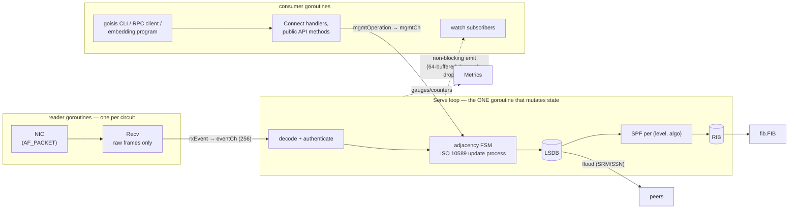

# Design

How goisis is put together: the philosophy behind it, the threading model,
the invariants the code relies on, and the limitations that are deliberate.
([日本語](design.ja.md))

## Philosophy

goisis follows the [GoBGP](https://github.com/osrg/gobgp) recipe, applied to
IS-IS:

- **Library-first.** `pkg/server.IsisServer` is the product; `goisisd` is a
  thin wrapper that adds YAML config and a Connect RPC endpoint, and `goisis`
  is a CLI over that RPC. Anything the daemon can do, an embedding program can
  do directly.
- **Dependency-free core.** The library core imports no netlink, no
  Prometheus, no RPC stack. Side effects leave the core only through two
  small interfaces — `fib.FIB` (forwarding) and `server.Metrics` (telemetry) —
  whose defaults are no-ops. The netlink FIB and the Prometheus adapter are
  separate packages that only the daemon links.
- **One goroutine owns the protocol.** Rather than fine-grained locking,
  every piece of protocol state (circuits, adjacencies, the LSDB, the RIB) is
  owned by a single event loop. Concurrency bugs are designed out, not locked
  out. See [Threading model](#threading-model).
- **The codec is pure.** `pkg/packet` is functions from bytes to structs and
  back — no I/O, no state, fuzzed continuously, and validated byte-for-byte
  against golden PDUs captured from FRR.
- **Explicit protocol code.** State machines are written out per ISO/RFC
  clause, and non-obvious decisions carry a comment citing the clause they
  implement. When the spec and convenience disagree, the file says which one
  won and why.
- **Scope discipline.** A deliberately small MVP (single-area, wide metrics)
  implemented carefully beats a broad one implemented loosely. Deferred
  features are listed under [Limitations](#limitations), and where a design
  choice would make one of them harder later, the code comment says so.

## System overview



| Package | Role |
|---------|------|
| `pkg/packet` | PDU/TLV codec. Pure, fuzzed, byte-exact round-trip. |
| `pkg/datalink` | Circuit transport: AF_PACKET on Linux, race-safe mock for tests. |
| `pkg/server` | The instance: management loop, adjacency FSM, LSDB/flooding, SPF, RIB, origination, Connect handlers, Flex-Algo. |
| `pkg/fib` | `FIB` interface + netlink implementation (`proto isis` routes, seg6local End SIDs). |
| `pkg/config` | YAML → server options. |
| `pkg/metrics` | Prometheus adapter for `server.Metrics` (the only package linking `client_golang`). |

## Threading model

There are exactly three kinds of goroutines, and only one of them mutates
protocol state.

| Goroutine | Count | May touch state? | Job |
|-----------|-------|------------------|-----|
| **Serve loop** | 1 | **yes — the only one** | Decodes and authenticates received PDUs, handles events, timers, and management ops; runs SPF; writes the FIB; emits watch events and metrics. |
| Circuit readers | 1 per circuit | no | `Recv` a raw frame and forward it to the loop as an `rxEvent`. Nothing else — no decoding, no state. |
| Consumers | any | no | Callers of the public API and watch subscribers. They never see internal state — only snapshots and events. |

Decoding runs on the loop (`handleRx`): padding is trimmed to the declared
PDU length, the PDU is decoded, authentication is verified, and only then is
protocol state touched. Undecodable PDUs are logged at debug and dropped. A
useful consequence: even the codec only ever parses hostile input on one
goroutine, serially.

### The Serve loop

`IsisServer.Serve` is a single `select` over four sources
(`pkg/server/server.go`):

```go
select {
case <-ctx.Done():        // shutdown
case op := <-s.mgmtCh:    // a management operation (public API call)
case ev := <-s.eventCh:   // a protocol event (received frame, ...)
case t := <-ticker.C:     // 1s housekeeping tick
}
if s.spfDirty { s.updateRIB(...) }   // event-driven SPF
```

Everything that mutates protocol state runs inside one of those arms, on this
goroutine. That is the central invariant of the codebase: **if you are not on
the Serve goroutine, you do not touch `IsisServer` fields.**

- **Management operations.** Every public method — reads like `ListRoutes`
  and mutations like `AddLocator` — wraps its body in `mgmtOperation`, which
  ships the closure to the loop over `mgmtCh` and waits for the result.
  Callers get either the closure's error, their context error, or
  `ErrServerStopped`; a result that races with shutdown is not lost
  (`server.go`, the `done`/`errCh` double-select).
- **Event-driven SPF.** Mutations never call SPF directly; they set
  `spfDirty` via `markDirty()`. After *every* loop iteration the flag is
  checked, so routes recompute promptly after a change without a fixed SPF
  timer, and a burst of events coalesces into one recompute per turn.
- **Housekeeping (1s tick).** Hellos, adjacency expiry, LSP aging/refresh,
  SRM/SSN retransmission, periodic CSNPs on circuits where we are DIS, local
  SID re-assertion, and gauge emission.

### Fan-out without back-pressure

The loop must never block on a consumer:

- **Watchers** (`WatchEvent` subscribers) get a 64-entry buffered channel.
  `emit` is a non-blocking send; a subscriber that falls behind is dropped
  (channel closed, `Lagged()` reports true) rather than stalling the loop.
  The Connect stream turns that into `ResourceExhausted` so clients
  resubscribe.
- **Metrics** are emitted from the loop only; implementations need to
  synchronize the read/scrape side alone.

### Sink contracts

Two injected interfaces are called *synchronously from the loop*, so they
carry a hard contract: **`datalink.Transport.Send` and every `fib.FIB` method
must not block.** A hung netlink call or a full socket would stall hellos,
adjacency expiry, and flooding on *every* circuit — the loop is the whole
control plane. Implementations that do slow I/O must queue internally and
return promptly. (`Recv` may block; it runs on a dedicated reader goroutine.)

This is the known structural trade-off of the single-loop design: egress and
FIB writes currently share the protocol goroutine. Moving them behind
per-circuit send queues and an async FIB worker (reporting completions back
as events) is the planned evolution if it ever shows up in practice.

### Shutdown ordering

Cancelling `Serve`'s context runs a fixed sequence (`shutdown` in
`server.go`):

1. Purge our own LSPs and flush the purges onto the wire — **first**, so
   peers reconverge around us immediately instead of black-holing traffic
   until MaxAge.
2. Close every circuit transport, which also unblocks the readers' `Recv`.
3. Remove local End SIDs from the FIB.
4. Close all watch subscriptions.
5. Wait for the reader goroutines to exit.
6. Drain queued management operations, failing them with `ErrServerStopped`.

The daemon layers its own ordering on top: the RPC server drains before the
loop stops, so in-flight RPCs still reach a live loop.

## Codec design

`pkg/packet` has three rules:

1. **Three-level registry, context-keyed.** TLV → sub-TLV → sub-sub-TLV
   decoders are registered per parent context (`SubTLVContext*`), because the
   same code point means different things under different parents. Duplicate
   registration panics at init — never on network input.
2. **Unknown means preserved.** Code points the codec does not model decode
   into `UnknownTLV`/`UnknownSubTLV` carrying their raw bytes, and
   re-serialize identically. A goisis node can sit in a network full of
   extensions it has never heard of without corrupting them.
3. **Decoded structs are for *this* node; raw bytes are for the network.**
   Received LSPs are stored and re-flooded from the bytes as received
   (`lspEntry.raw`) — only the remaining-lifetime field is patched on send,
   which the Fletcher checksum deliberately excludes. Checksum validation
   also runs over the raw bytes, never a re-serialization. Flooding
   correctness therefore does not depend on codec round-trip fidelity.

Two invariants matter beyond the codec:

- **Prefix masking.** Every decoder that feeds routing masks host bits from
  prefixes, so the RIB, the FIB, and the startup sweep all key on identical
  `netip.Prefix` values. An unmasked prefix would install a route the sweep
  could never match again.
- **Fuzzing contract.** `FuzzDecodePDU` / `FuzzDecodeTLVs` assert
  decode → encode → decode reaches a fixed point (idempotence, not byte
  equality — reserved bits are normalized once), seeded with FRR-captured
  PDUs; `FuzzVerifyAuth` and `FuzzParseNET` assert no panic on arbitrary
  input.

## Routing pipeline

- **LSDB.** One database per level; entries hold both the decoded LSP and
  the raw bytes (see above). `newer()` implements the ISO 10589 ordering;
  purges are held for ZeroAgeLifetime after going to zero.
- **Flooding.** Per-circuit SRM/SSN flag sets drive retransmission: LAN
  reliability comes from the DIS's periodic CSNPs, p2p reliability from
  PSNP acknowledgements with a minimum retransmission interval. Purges are
  flooded header-only (POI + authentication when keyed), for both our own
  LSPs and expired foreign ones.
- **Origination.** Own LSPs are rebuilt from config + adjacency state and
  compared against the stored copy — unchanged content is not re-flooded.
  TLV sets that exceed the 1492-byte LSP buffer are packed by serialized
  size into fragment 0 plus spill fragments 1..255; stale fragments are
  purged when the set shrinks.
- **SPF.** Dijkstra per `(level, algorithm)` over a topology built from the
  LSDB, with the ISO two-way connectivity check, pseudonode zero-cost edges,
  overload-bit transit avoidance, 64-bit metric accumulation with an
  overflow ceiling, and ECMP by first-hop set union (including prefix-level
  anycast merge). `popMin` is a linear scan — O(V²) is a documented MVP
  choice.
- **RIB → FIB.** Route selection across levels and algorithms is an explicit
  comparator (`betterRoute`): Level-1 beats Level-2, then algorithm 0 beats
  Flex-Algo. The RIB holds the *desired* state; FIB write failures land in a
  pending set retried on the next recompute, surfaced by the
  `goisis_fib_pending` gauge. On startup the FIB is swept of routes a
  previous incarnation left behind.
- **Flex-Algo (RFC 9350).** Definition election follows priority / system-ID;
  participation prunes the topology per algorithm. Only the IGP metric is
  computed today; constraint sub-sub-TLVs are preserved on the wire for a
  later ASLA-aware computation.

## Security posture

- **Authentication before state.** HMAC verification (MD5 per RFC 5304,
  SHA-1/256/384/512 per RFC 5310) runs before any protocol processing;
  comparison is constant-time (`hmac.Equal`); the digest, remaining-lifetime,
  and checksum fields are zeroed per spec before MAC computation; a PDU
  carrying more than one Authentication TLV fails verification and is
  dropped.
- **The codec assumes hostile input.** Every length field is validated
  before slicing or allocation; malformed PDUs are dropped and counted, never
  fatal.
- **LSDB cap.** `lsdb-entry-limit` bounds stored LSPs per level as defense
  in depth against fabricated-source flooding on unauthenticated segments —
  authentication is the primary mitigation.
- **Management plane.** The Connect API is plaintext h2c without
  authentication, bound to loopback by default; binding it further requires
  the explicit `-api-allow-remote` opt-in. Protect it externally (TLS
  proxy, unix socket permissions, network policy) before exposing it.

## Limitations

Deliberate scope for the current milestone; the design keeps them reachable.

| Limitation | Notes |
|------------|-------|
| Single area | L1/L2 adjacencies and per-level SPF work, but there is no inter-area route leaking — the up/down bit (RFC 5305 §4.1 / RFC 5308 §2) is parsed and preserved, never set by origination. |
| Wide metrics only | Narrow-metric TLVs are parsed but never originated (`metric-style wide` peers only). |
| No multi-topology (RFC 5120) | The SPF/RIB key is `(level, algorithm)`; MT-IDs are parsed where they appear but not threaded through the pipeline. Adding MT means widening that key — a known, contained change. |
| No graceful restart (RFC 5306) | A peer that crash-restarts and re-originates at sequence 1 is out-shouted by our stored higher-seq copy until it ages out (up to MaxAge, 1200s). Clean shutdowns purge, so this affects only ungraceful restarts. |
| No BFD | Failure detection is hello-based (hold time). |
| Sequence-number wrap unhandled | ISO 10589's exhaustion procedure at 2³² is documented-not-implemented; at the 900s refresh rate that is ~120k years away. |
| Flex-Algo computes IGP metric only | FAD constraints (admin groups, SRLG, delay) are preserved on the wire, not evaluated. |
| Synchronous egress/FIB on the loop | See [Sink contracts](#sink-contracts): non-blocking is a contract on implementations, not enforced by structure. |
| Full recompute per change | No incremental SPF; every topology change rebuilds the `(level, algo)` topologies. Fine for MVP-scale areas. |
| No RFC 7987 lifetime floor | Received-LSP aging follows the advertised remaining lifetime as-is. |
| End.DT46 | Declared in the `fib` API but not programmable via the netlink FIB (the vendored library lacks the seg6local action); End/End.DT4/End.DT6 work. |

## Testing strategy

| Layer | How |
|-------|-----|
| Codec | Unit tests + golden PDUs captured from FRR (`test/fixturegen`) + continuous fuzzing (idempotence + no-panic contracts). |
| Protocol | In-process tests: servers wired with `datalink.Link` mock transports converge for real (adjacency, flooding, routes) with no privileges; white-box tests inject LSPs (`injectLSP`) and call `computeSPF` directly. |
| Determinism | Tests synchronize through `mgmtOperation` round-trips instead of sleeps wherever possible — the single-loop design is what makes that work. |
| Interop | `test/interop`: goisis on the host end of a veth pair against a real FRR isisd container (broadcast + p2p, auth, SRv6, Flex-Algo, fragmentation, ping through programmed routes). Needs root + docker; runs on every push/PR in CI. |
