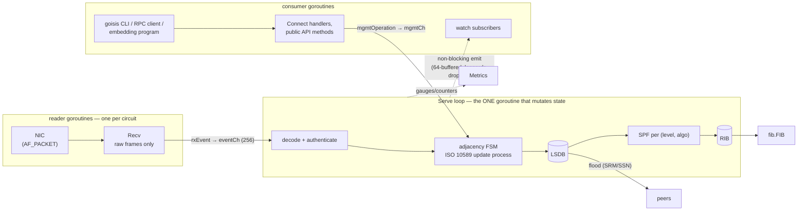

# Design

How goisis is put together: the philosophy behind it, the threading model,
the invariants the code relies on, and the limitations that are deliberate.
([日本語](design.ja.md))

## Philosophy

goisis follows the [GoBGP](https://github.com/osrg/gobgp) recipe, applied to
IS-IS:

- **Library-first.** `pkg/server.IsisServer` is the product; `goisisd` is a
  thin wrapper that adds YAML config and a Connect RPC endpoint, and `goisis`
  is a CLI over that RPC. Anything the daemon can do, an embedding program can
  do directly.
- **Dependency-free core.** The library core imports no netlink, no
  Prometheus, no RPC stack. Side effects leave the core only through two
  small interfaces — `fib.FIB` (forwarding) and `server.Metrics` (telemetry) —
  whose defaults are no-ops. The netlink FIB and the Prometheus adapter are
  separate packages that only the daemon links.
- **One goroutine owns the protocol.** Rather than fine-grained locking,
  every piece of protocol state (circuits, adjacencies, the LSDB, the RIB) is
  owned by a single event loop. Concurrency bugs are designed out, not locked
  out. See [Threading model](#threading-model).
- **The codec is pure.** `pkg/packet` is functions from bytes to structs and
  back — no I/O, no state, fuzzed continuously, and validated byte-for-byte
  against golden PDUs captured from FRR.
- **Explicit protocol code.** State machines are written out per ISO/RFC
  clause, and non-obvious decisions carry a comment citing the clause they
  implement. When the spec and convenience disagree, the file says which one
  won and why.
- **Scope discipline.** A deliberately small MVP (single-area, wide metrics)
  implemented carefully beats a broad one implemented loosely. Deferred
  features are listed under [Limitations](#limitations), and where a design
  choice would make one of them harder later, the code comment says so.

## System overview


```mermaid
flowchart LR
    subgraph readers["reader goroutines — one per circuit"]
        NIC["NIC<br/>(AF_PACKET)"] --> RECV["Recv<br/>raw frames only"]
    end
    subgraph serve["Serve loop — the ONE goroutine that mutates state"]
        DECODE["decode + authenticate"] --> PROTO["adjacency FSM<br/>ISO 10589 update process"]
        PROTO --> LSDB[("LSDB")]
        LSDB --> SPF["SPF per (level, algo)"] --> RIB[("RIB")]
    end
    subgraph consumers["consumer goroutines"]
        API["goisis CLI / RPC client /<br/>embedding program"] --> HANDLERS["Connect handlers,<br/>public API methods"]
        WATCH["watch subscribers"]
    end
    RECV -- "rxEvent → eventCh (256)" --> DECODE
    HANDLERS -- "mgmtOperation → mgmtCh" --> PROTO
    LSDB -- "flood (SRM/SSN)" --> PEERS["peers"]
    RIB --> FIB["fib.FIB"]
    serve -. "non-blocking emit<br/>(64-buffered, laggards dropped)" .-> WATCH
    serve -. "gauges/counters" .-> MET["Metrics"]
```

| Package | Role |
|---------|------|
| `pkg/packet` | PDU/TLV codec. Pure, fuzzed, byte-exact round-trip. |
| `pkg/datalink` | Circuit transport: AF_PACKET on Linux, race-safe mock for tests. |
| `pkg/server` | The instance: management loop, adjacency FSM, LSDB/flooding, SPF, RIB, origination, Connect handlers, Flex-Algo. |
| `pkg/fib` | `FIB` interface + netlink implementation (`proto isis` routes, seg6local End SIDs). |
| `pkg/config` | YAML → server options; the netlink interface watcher that feeds address and link changes back in. |
| `pkg/metrics` | Prometheus adapter for `server.Metrics` (the only package linking `client_golang`). |

## Threading model

There are exactly three kinds of goroutines, and only one of them mutates
protocol state.

| Goroutine | Count | May touch state? | Job |
|-----------|-------|------------------|-----|
| **Serve loop** | 1 | **yes — the only one** | Decodes and authenticates received PDUs, handles events, timers, and management ops; runs SPF; writes the FIB; emits watch events and metrics. |
| Circuit readers | 1 per circuit | no | `Recv` a raw frame and forward it to the loop as an `rxEvent`; a transient `Recv` error is logged and retried after a second. Nothing else — no decoding, no state. |
| Consumers | any | no | Callers of the public API and watch subscribers. They never see internal state — only snapshots and events. |

Decoding runs on the loop (`handleRx`): padding is trimmed to the declared
PDU length, the PDU is decoded, authentication is verified, and only then is
protocol state touched. Undecodable PDUs are logged at debug and dropped. A
useful consequence: even the codec only ever parses hostile input on one
goroutine, serially.

### The Serve loop

`IsisServer.Serve` is a single `select` over five sources
(`pkg/server/server.go`):

```go
select {
case <-ctx.Done():        // shutdown
case op := <-s.mgmtCh:    // a management operation (public API call)
case ev := <-s.eventCh:   // a protocol event (received frame, ...)
case t := <-ticker.C:     // 1s housekeeping tick
case <-hold.C:            // SPF back-off hold expired
}
s.drainLSPGen(time.Now())                        // coalesced own-LSP regeneration
if s.spfDirty && !holding { s.updateRIB(...) }   // event-driven SPF with an RFC 8405-lite hold
```

Everything that mutates protocol state runs inside one of those arms, on this
goroutine. That is the central invariant of the codebase: **if you are not on
the Serve goroutine, you do not touch `IsisServer` fields.**

- **Management operations.** Every public method — reads like `ListRoutes`
  and mutations like `AddLocator` — wraps its body in `mgmtOperation`, which
  ships the closure to the loop over `mgmtCh` and waits for the result.
  Callers get either the closure's error, their context error, or
  `ErrServerStopped`; a result that races with shutdown is not lost
  (`server.go`, the `done`/`errCh` double-select).
- **Event-driven SPF.** Mutations never call SPF directly; they set
  `spfDirty` via `markDirty()`. The first change recomputes at the end of
  that loop iteration; changes arriving during the following 200 ms hold
  coalesce into one more recompute when the hold expires (a two-state
  RFC 8405 back-off without its LONG_WAIT stage).
- **Housekeeping (1s tick).** Hellos, adjacency expiry, LSP aging/refresh,
  SRM/SSN retransmission,
  periodic CSNPs on circuits where we are DIS, local SID re-assertion, and
  gauge emission.
- **Interface events.** Addresses and connected subnets are not read once at
  startup: the daemon subscribes to netlink address and link changes
  (`pkg/config.WatchInterfaces`) and pushes each one in as a management
  operation — `SetCircuitAddresses` for a renumbering, `SetCircuitLinkState`
  for carrier. A link reported down drops its adjacencies immediately instead
  of after the neighbor's holding time. Netlink delivery is not guaranteed, so
  the watched interfaces are re-read on a subscription error and every 30 s;
  both setters are idempotent, so a lost message costs one interval, not a
  restart. The core stays netlink-free: the
  watcher lives in the daemon-side package, and an embedder owns the event
  source itself.

### Fan-out without back-pressure

The loop must never block on a consumer:

- **Watchers** (`WatchEvent` subscribers) get a 64-entry buffered channel.
  `emit` is a non-blocking send; a subscriber that falls behind is dropped
  (channel closed, `Lagged()` reports true) rather than stalling the loop.
  The Connect stream turns that into `ResourceExhausted` so clients
  resubscribe.
- **Metrics** are emitted from the loop only; implementations need to
  synchronize the read/scrape side alone.

### Sink contracts

Two injected interfaces are called *synchronously from the loop*, so they
carry a hard contract: **`datalink.Transport.Send` and every `fib.FIB` method
must not block.** A hung netlink call or a full socket would stall hellos,
adjacency expiry, and flooding on *every* circuit — the loop is the whole
control plane. Implementations that do slow I/O must queue internally and
return promptly. (`Recv` may block; it runs on a dedicated reader goroutine.)

This is the known structural trade-off of the single-loop design: egress and
FIB writes currently share the protocol goroutine. Moving them behind
per-circuit send queues and an async FIB worker (reporting completions back
as events) is the planned evolution if it ever shows up in practice.

### Shutdown ordering

Cancelling `Serve`'s context runs a fixed sequence (`shutdown` in
`server.go`):

1. Purge our own LSPs and flush the purges onto the wire — **first**, so
   peers reconverge around us immediately instead of black-holing traffic
   until MaxAge.
2. Close every circuit transport, which also unblocks the readers' `Recv`.
3. Remove local End SIDs from the FIB.
4. Close all watch subscriptions.
5. Wait for the reader goroutines to exit.
6. Drain queued management operations, failing them with `ErrServerStopped`.

The daemon layers its own ordering on top: the RPC server drains before the
loop stops, so in-flight RPCs still reach a live loop.

## Codec design

`pkg/packet` has three rules:

1. **Three-level registry, context-keyed.** TLV → sub-TLV → sub-sub-TLV
   decoders are registered per parent context (`SubTLVContext*`), because the
   same code point means different things under different parents. Duplicate
   registration panics at init — never on network input.
2. **Unknown means preserved.** Code points the codec does not model decode
   into `UnknownTLV`/`UnknownSubTLV` carrying their raw bytes, and
   re-serialize identically. A goisis node can sit in a network full of
   extensions it has never heard of without corrupting them.
3. **Decoded structs are for *this* node; raw bytes are for the network.**
   Received LSPs are stored and re-flooded from the bytes as received
   (`lspEntry.raw`) — only the remaining-lifetime field is patched on send,
   which the Fletcher checksum deliberately excludes. Checksum validation
   also runs over the raw bytes, never a re-serialization. Flooding
   correctness therefore does not depend on codec round-trip fidelity.

Two invariants matter beyond the codec:

- **Prefix masking.** Every decoder that feeds routing masks host bits from
  prefixes, so the RIB, the FIB, and the startup sweep all key on identical
  `netip.Prefix` values. An unmasked prefix would install a route the sweep
  could never match again.
- **Fuzzing contract.** `FuzzDecodePDU` / `FuzzDecodeTLVs` assert
  decode → encode → decode reaches a fixed point (idempotence, not byte
  equality — reserved bits are normalized once), seeded with FRR-captured
  PDUs; `FuzzVerifyAuth` and `FuzzParseNET` assert no panic on arbitrary
  input.

## Routing pipeline

- **LSDB.** One database per level; entries hold both the decoded LSP and
  the raw bytes (see above). `newer()` implements the ISO 10589 ordering;
  purges are held for ZeroAgeLifetime after going to zero.
- **Flooding.** Per-circuit SRM/SSN flag sets drive retransmission: LAN
  reliability comes from the DIS's periodic CSNPs — split into per-PDU LSP-ID
  ranges so a database larger than one PDU still fits the MTU, and the only
  answer to a PSNP request, since only the Designated IS processes PSNPs on a
  broadcast circuit (ISO 10589 7.3.15.2 b). p2p reliability comes from PSNP
  acknowledgements with a minimum retransmission interval. The update process
  accepts an LSP, CSNP or PSNP only from a source SNPA with an Up adjacency
  (ISO 10589 7.3.15.1/7.3.15.2). A p2p circuit transmits nothing without an Up
  adjacency and drops its flags when the adjacency goes down; when one comes Up
  the whole database at that level is re-flagged and a CSNP sent
  (`syncCircuitLevel`, ISO 10589 7.3.17) — p2p has no periodic CSNP to repair a
  gap later. Both are paced: one housekeeping pass sends at most
  `maxLSPSendPerTick` LSPs per circuit and level, the rest keeping their flags
  for the following ticks, and a synchronization asked for within
  `syncHoldDown` of the last one is deferred to the end of it rather than run,
  so a neighbor flapping its handshake cannot buy a database walk per second.
  An LSP too large for a circuit is dropped on that circuit once
  with a warning instead of retried forever. Purges are flooded header-only
  (POI + authentication when keyed), for both our own LSPs and expired foreign
  ones; a purge for an LSP ID the database does not hold is acknowledged but
  never stored (7.3.16.4 a), and one naming our own System ID that we do not
  own is purged rather than re-flooded (7.3.16.4 c).
- **Origination.** Own LSPs are rebuilt from config + adjacency state and
  compared against the stored copy — unchanged content is not re-flooded.
  Event-driven regenerations coalesce to at most one per second
  (minimumLSPGenerationInterval), and the 900 s refresh is jittered up to
  25 % early so nodes that booted together do not refresh in lockstep.
  TLV sets that exceed the LSP buffer — 1492 bytes, or less when the
  circuits (or `lsp-mtu`) are narrower — are packed by serialized size into
  fragment 0 plus spill fragments 1..255; stale fragments are purged when the
  set shrinks. Re-origination is also where End.X SIDs are reconciled: an Up
  adjacency with a global on-link neighbour address holds one SID per locator
  whose algorithm the neighbour participates in, taken from that locator's
  function space, and a SID whose adjacency, address or participation is gone
  is released and removed from the FIB. The neighbour publishes both the
  address and the participation in its fragment-0 LSP, which arrives after the
  adjacency does, so installing one asks for a re-origination.
- **SPF.** Dijkstra per `(level, algorithm)` over a topology built from the
  LSDB, with the ISO two-way connectivity check, pseudonode zero-cost edges,
  overload-bit transit avoidance, 64-bit metric accumulation with an
  overflow ceiling, and ECMP by first-hop set union (including prefix-level
  anycast merge). `popMin` is a linear scan — O(V²) is a documented MVP
  choice.
- **RIB → FIB.** Route selection across levels and algorithms is an explicit
  comparator (`betterRoute`): Level-1 beats Level-2, then algorithm 0 beats
  Flex-Algo. The RIB holds the *desired* state; FIB write failures land in a
  pending set retried on the next recompute and, in a quiet network, on every
  housekeeping tick; its size is the `goisis_fib_pending` gauge. Routes carry metric 115 (the IS-IS
  administrative distance), so they never share the kernel's
  `[prefix, tos, priority]` key with a connected route and cannot replace one.
  On startup the FIB is swept of routes a previous incarnation left behind.
- **Local SIDs.** End and End.DT SIDs are `seg6local` routes on `isis-srv6`, a
  dummy device the netlink FIB creates on demand and deletes again with the
  last SID on it — the startup sweep prunes it too, so a run that no longer
  advertises a locator leaves neither routes nor a device behind. The loopback
  cannot carry them: Linux (6.12 observed) drops the lwtunnel state of a
  `seg6local` route whose output device is `lo`, leaving a plain route to the
  SID that reads back with no encapsulation and swallows every packet steered
  at it. One shared device rather than one per locator — the device is only
  somewhere to hang the route — under a fixed name, so a restart finds and
  reuses the one it made. End.X SIDs are the exception and stay on the circuit
  their adjacency is on. A device that cannot be created is logged once (the
  install is retried every housekeeping tick) and counted in
  `goisis_fib_errors_total{op="add_sid"}`; the daemon starts and routes anyway.
- **Flex-Algo (RFC 9350).** Definition election follows priority / system-ID;
  participation prunes the topology per algorithm — and, because an End.X SID
  carries its locator's algorithm (RFC 9352 §8.1), it also gates which
  adjacencies a Flex-Algo locator hands an End.X SID to, on the same predicate
  SPF prunes with. Only the IGP metric is computed today; constraint
  sub-sub-TLVs are preserved on the wire for a later ASLA-aware computation.

## Security posture

- **Authentication before state.** HMAC verification (MD5 per RFC 5304,
  SHA-1/256/384/512 per RFC 5310) runs before any protocol processing;
  comparison is constant-time (`hmac.Equal`); the digest, remaining-lifetime,
  and checksum fields are zeroed per spec before MAC computation; a PDU
  carrying more than one Authentication TLV fails verification and is
  dropped.
- **The codec assumes hostile input.** Every length field is validated
  before slicing or allocation; malformed PDUs are dropped and counted, never
  fatal.
- **LSDB cap.** `lsdb-entry-limit` bounds stored LSPs per level as defense
  in depth against fabricated-source flooding on unauthenticated segments —
  authentication is the primary mitigation.
- **Management plane.** The Connect API is plaintext h2c without
  authentication, bound to loopback by default; binding it further requires
  the explicit `-api-allow-remote` opt-in — an empty host (`:50051`) counts as
  binding every interface. For local access prefer
  `-api-listen unix:///run/goisis/goisisd.sock`: the socket is bound under a
  umask that makes it mode `0660` from the instant it exists, so filesystem
  permissions become the access control. Over TCP loopback there is no identity
  to authorize, so any local UID can originate area-wide reachability; making
  the unix socket the default is a breaking change for the daemon and the CLI
  and is deferred to 0.4.0. Exposing the API over the network needs external
  protection (TLS proxy, network policy).

## Limitations

Deliberate scope for the current milestone; the design keeps them reachable.

| Limitation | Notes |
|------------|-------|
| Single area | L1/L2 adjacencies and per-level SPF work, an L1-only node installs a default route toward the nearest attached L1L2 IS (the ATT bit, RFC 1195 §3.2), and an L1L2 IS propagates the prefixes its Level-1 SPF reached into its Level-2 LSP (ISO 10589 7.2.9 / RFC 1195 §3.1). Only L2→L1 leaking is missing: the up/down bit (RFC 5305 §4.1 / RFC 5308 §2) is parsed and honored — a down-marked prefix is never propagated upward — but never set by origination. |
| Wide metrics only | Narrow-metric TLVs are parsed but never originated (`metric-style wide` peers only). |
| No multi-topology (RFC 5120) | The SPF/RIB key is `(level, algorithm)`; MT-IDs are parsed where they appear but not threaded through the pipeline. Adding MT means widening that key — a known, contained change. |
| No graceful restart (RFC 5306) | A peer that crash-restarts and re-originates at sequence 1 is out-shouted by our stored higher-seq copy until it ages out (up to MaxAge, 1200s). Clean shutdowns purge, so this affects only ungraceful restarts. |
| No BFD | Failure detection is hello-based (hold time). |
| No runtime circuit add/remove or config reload | Prefixes, locators, Flex-Algos, the overload bit and adjacency resets change at runtime, and a circuit's addresses and carrier are followed live (`SetCircuitAddresses` / `SetCircuitLinkState`). Adding or removing a circuit, or changing an authentication key, still needs a restart — accept lists (`*-accept-passwords`) make a key change a rolling restart rather than a flag day. |
| Sequence-number wrap unhandled | ISO 10589's exhaustion procedure at 2³² is documented-not-implemented; at the 900s refresh rate that is ~120k years away. |
| Flex-Algo computes IGP metric only | FAD constraints (admin groups, SRLG, delay) are preserved on the wire, not evaluated. |
| Synchronous egress/FIB on the loop | See [Sink contracts](#sink-contracts): non-blocking is a contract on implementations, not enforced by structure. |
| No RFC 8405 LONG_WAIT | SPF back-off is two-state (recompute immediately, then coalesce for 200 ms). The escalation to a long wait under sustained churn is deliberately omitted: a second threshold would only delay convergence further at MVP scale. |
| Full recompute per change | No incremental SPF; every topology change rebuilds the `(level, algo)` topologies. Fine for MVP-scale areas. |
| No RFC 7987 lifetime floor | Received-LSP aging follows the advertised remaining lifetime as-is. |
| Local SIDs need a device of their own | End/End.DT SIDs go on the `isis-srv6` dummy device the netlink FIB creates, never the loopback — see **Local SIDs** above for the kernel behaviour that forces it. The device is shared by every locator and is removed with the last SID on it. |
| End.DT46 | Declared in the `fib` API but not programmable via the netlink FIB (the vendored library lacks the seg6local action); End/End.X/End.DT4/End.DT6 work. |
| End.X SIDs are unprotected | One End.X SID per (locator, adjacency), advertised with flags and weight zero: no backup (B) flag, no SID sets (S), and no persistence across restarts (P), so a restart reallocates function values. TI-LFA, which is what the B flag would feed, is out of scope. |
| End.X needs a global on-link neighbour address | An End.X SID is allocated, advertised and programmed only where the neighbour has a global IPv6 address inside one of the circuit's connected prefixes — taken from TLV 232 of its fragment-0 LSP, or from its hellos where it lists one there. Linux resolves an End.X next hop against the *ingress* interface, so a link-local next hop (all RFC 5308 gives) forwards only a hairpin and drops transit traffic. Hellos therefore stay link-local (RFC 5308 3) and goisis publishes its global addresses in TLV 232 of its LSP, so an End.X SID appears between two `goisisd` nodes wherever the link carries a global subnet. FRR publishes no IPv6 Interface Address TLV at all in its LSP (TLV 232 is absent from every captured FRR LSP under `pkg/packet/testdata`), so no End.X SID is advertised towards an FRR neighbour. Where no address is known, nothing is allocated, advertised or programmed and the adjacency is warned about once. |

## Testing strategy

| Layer | How |
|-------|-----|
| Codec | Unit tests + golden PDUs captured from FRR (`test/fixturegen`) + continuous fuzzing (idempotence + no-panic contracts). |
| Protocol | In-process tests: servers wired with `datalink.Link` mock transports converge for real (adjacency, flooding, routes) with no privileges; white-box tests inject LSPs (`injectLSP`) and call `computeSPF` directly. |
| Determinism | Tests synchronize through `mgmtOperation` round-trips instead of sleeps wherever possible — the single-loop design is what makes that work. |
| Benchmarks | `BenchmarkComputeSPF` sizes the O(V^2) `popMin` choice: numbers for 50/200/1000 nodes in the PR. |
| Interop | `test/interop`: goisis on the host end of a veth pair against a real FRR isisd container (broadcast + p2p, auth, SRv6, Flex-Algo, fragmentation, ping through programmed routes). Needs root + docker; runs on every push/PR in CI. |
